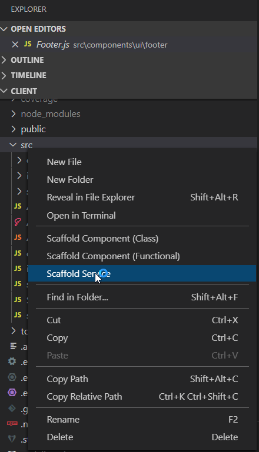

# scaffold-serverless-service-vscode

VS Code Extension that adds explorer context actions & commands to scaffold a new Serverless service. Uses [scaffold-serverless-service](https://github.com/squaredup/scaffold-serverless-service).

   